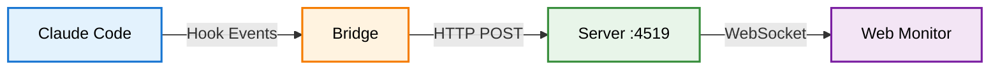
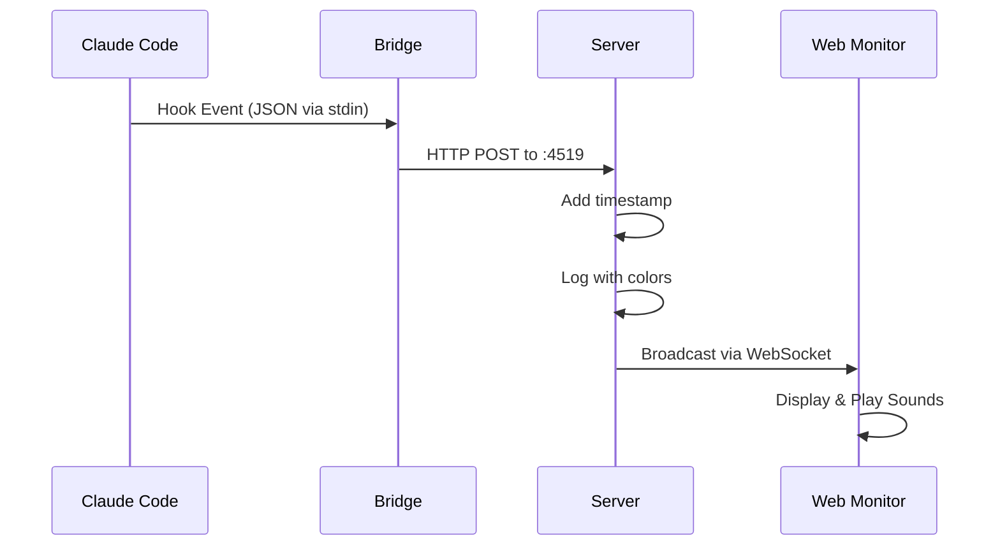

# Madame Claude - Claude Code Hook Monitor

Madame Claude is a real-time monitoring system for Claude Code hooks that captures and streams tool usage events to a web interface. It provides visibility into Claude Code's tool usage patterns, helping developers understand and debug their AI assistant's behavior.

## Overview

Madame Claude consists of three components that work together to capture, process, and display Claude Code hook events:

1. **bridge** - Captures hook events from stdin and forwards them via HTTP
2. **server** - Receives events and broadcasts them to connected web clients  
3. **monitor** - Web interface for real-time event visualization with sound notifications

## Architecture



### Data Flow



## Features

- **Real-time Monitoring**: See Claude Code events as they happen
- **Event Filtering**: Filter by session, tool, or event type
- **Sound Notifications**: Customizable sounds for Notification and Stop events
- **Color-coded Console**: Server logs with colored event types and tool names
- **Persistent Settings**: Volume controls saved to browser localStorage
- **Multiple Event Types**: Supports all Claude Code hook types:
  - PreToolUse
  - PostToolUse
  - Notification
  - Stop
  - SubagentStop

## Installation

### Prerequisites

- [Node.js](https://nodejs.org/) installed on your system
- Claude Code installed and configured

### Setup

1. Clone the repository:
```bash
git clone https://github.com/williamkapke/MadameClaude.git
cd MadameClaude
```

2. Install and start the server:
```bash
cd server
npm install
npm start
```

The server will start on `http://localhost:4519`

3. Configure Claude Code hooks in `~/.claude/settings.json` (macOS/Linux) or `%USERPROFILE%\.claude\settings.json` (Windows):

```json
{
  "hooks": {
    "PreToolUse": [{
      "matcher": ".*",
      "hooks": [{ "type": "command", "command": "node /path/to/MadameClaude/server/bridge.js" }]
    }],
    "PostToolUse": [{
      "matcher": ".*",
      "hooks": [{ "type": "command", "command": "node /path/to/MadameClaude/server/bridge.js" }]
    }],
    "Notification": [{
      "matcher": ".*",
      "hooks": [{ "type": "command", "command": "node /path/to/MadameClaude/server/bridge.js" }]
    }],
    "Stop": [{
      "matcher": ".*",
      "hooks": [{ "type": "command", "command": "node /path/to/MadameClaude/server/bridge.js" }]
    }],
    "SubagentStop": [{
      "matcher": ".*",
      "hooks": [{ "type": "command", "command": "node /path/to/MadameClaude/server/bridge.js" }]
    }]
  }
}
```

**Note**: Replace `/path/to/MadameClaude` with the actual path to your Madame Claude installation.

4. Open the web monitor:
   - Navigate to `http://localhost:4519` in your browser
   - The monitor will automatically connect to the server via WebSocket

## Usage

### Web Monitor Features

- **Session Filter**: Filter events by session ID
- **Tool Filter**: Filter events by tool name  
- **Type Filter**: Toggle visibility of different event types
- **Sound Settings**: Click the gear icon to adjust notification volumes
- **Event Details**: Click any event row to see the full JSON data
- **Location Badge**: See the working directory for each event

### Sound Notifications

The monitor plays sounds for specific events:
- **Notification events**: Play `notification.mp3`
- **Stop events**: Play `stop.mp3`

Volume can be adjusted or muted via the settings menu (gear icon).

### Server Console

The server displays colored output in the console:
- Timestamps in gray
- Event types in their respective colors:
  - PreToolUse: Blue
  - PostToolUse: Green
  - Notification: Orange
  - Stop: Red
  - SubagentStop: Purple
- Tool names in cyan

## Development

### Running Tests

```bash
cd server
npm test
```

### Linting

```bash
cd server
npm run lint
```

### Development Mode

Run the server with auto-reload on file changes:

```bash
cd server
npm run dev
```

### Project Structure

```
MadameClaude/
├── server/              # Event server and bridge
│   ├── server.js        # HTTP/WebSocket server
│   ├── bridge.js        # Hook event capture
│   ├── server.test.js   # Server tests
│   ├── bridge.test.js   # Bridge tests
│   └── package.json     # Node.js configuration
├── docs/                # Web interface (GitHub Pages)
│   ├── index.html       # Landing page
│   ├── monitor.html     # Monitor interface
│   ├── monitor.jpg      # Screenshot
│   ├── notification.mp3 # Notification sound
│   └── stop.mp3         # Stop sound
└── README.md            # This file
```

## Configuration

### Hook Matchers

You can filter which tools trigger hooks using the `matcher` field:

- `".*"` - Match all tools (recommended)
- `"Bash"` - Match only Bash commands
- `"Read|Write"` - Match Read or Write operations (regex)
- `"mcp__"` - Match MCP tool calls

### Custom Server URL

By default, bridge posts to `http://localhost:4519`. You can specify a different URL:

```json
{
  "command": "node /path/to/MadameClaude/server/bridge.js http://custom-server:port"
}
```

## NPM Package

Madame Claude is also available as an npm package:

```bash
npm install -g madame-claude
```

Then run:
```bash
madame-claude         # Start the server
bridge                # Run the bridge (for testing)
```

## Troubleshooting

### Server won't start
- Check if port 4519 is already in use
- Ensure Node.js is installed correctly

### No events appearing
- Verify hooks are configured correctly in Claude Code settings
- Check that the server is running
- Ensure bridge.js has the correct absolute path
- Try running `node /path/to/bridge.js` manually to test

### Sound not playing
- Check browser permissions for audio playback
- Ensure sound files exist in the docs directory
- Try adjusting volume in settings (gear icon)

## Contributing

Contributions are welcome! Please feel free to submit issues or pull requests.

## License

MIT License - See LICENSE file for details

## Credits

Sounds from [Notification Sounds](https://notificationsounds.com/)
- [Notification](https://notificationsounds.com/standard-ringtones/hurry-263)
- [Stop](https://notificationsounds.com/message-tones/achievement-message-tone)