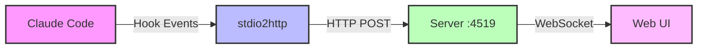
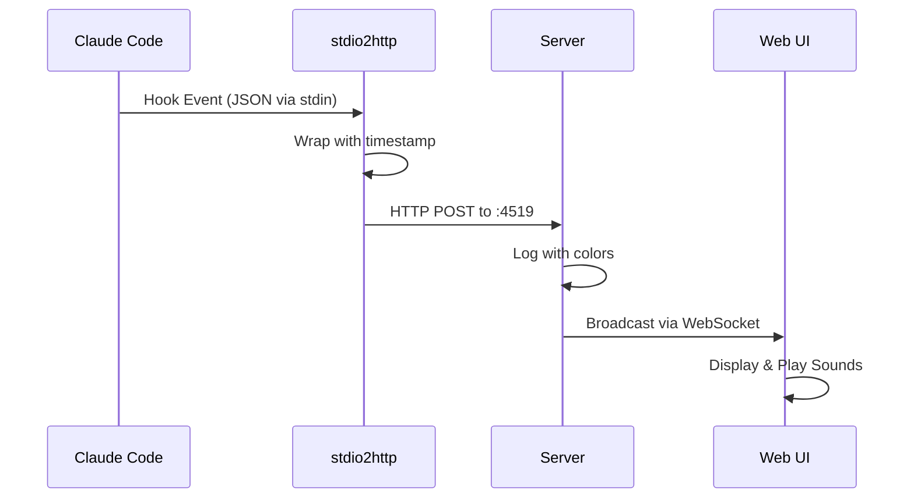

# Claudia - Claude Code Hook Monitor

Claudia is a real-time monitoring system for Claude Code hooks that captures and streams tool usage events to a web interface. It provides visibility into Claude Code's tool usage patterns, helping developers understand and debug their AI assistant's behavior.

## Overview

Claudia consists of three components that work together to capture, process, and display Claude Code hook events:

1. **stdio2http** - Captures hook events from stdin and forwards them via HTTP
2. **server** - Receives events and broadcasts them to connected web clients
3. **ui** - Web interface for real-time event visualization with sound notifications

## Architecture



### Data Flow



## Features

- **Real-time Monitoring**: See Claude Code events as they happen
- **Event Filtering**: Filter by session, tool, or event type
- **Sound Notifications**: Customizable sounds for Notification and Stop events
- **Color-coded Console**: Server logs with colored event types and tool names
- **Persistent Settings**: Volume controls saved to browser localStorage
- **Multiple Event Types**: Supports all Claude Code hook types:
  - PreToolUse
  - PostToolUse
  - Notification
  - Stop
  - SubagentStop

## Installation

### Prerequisites

- [Deno](https://deno.land/) installed on your system
- Claude Code installed and configured

### Setup

1. Clone the repository:
```bash
git clone https://github.com/williamkapke/claudia.git
cd claudia
```

2. Start the server:
```bash
cd server
deno task start
```

The server will start on `http://localhost:4519`

3. Configure Claude Code hooks in `~/.claude/settings.json`:

```json
{
  "hooks": {
    "PreToolUse": [
      {
        "matcher": "",
        "hooks": [
          {
            "type": "command",
            "command": "/absolute/path/to/claudia/stdio2http/main.ts"
          }
        ]
      }
    ],
    "PostToolUse": [
      {
        "matcher": "",
        "hooks": [
          {
            "type": "command",
            "command": "/absolute/path/to/claudia/stdio2http/main.ts"
          }
        ]
      }
    ],
    "Notification": [
      {
        "matcher": "",
        "hooks": [
          {
            "type": "command",
            "command": "/absolute/path/to/claudia/stdio2http/main.ts"
          }
        ]
      }
    ],
    "Stop": [
      {
        "matcher": "",
        "hooks": [
          {
            "type": "command",
            "command": "/absolute/path/to/claudia/stdio2http/main.ts"
          }
        ]
      }
    ],
    "SubagentStop": [
      {
        "matcher": "",
        "hooks": [
          {
            "type": "command",
            "command": "/absolute/path/to/claudia/stdio2http/main.ts"
          }
        ]
      }
    ]
  }
}
```

**Note**: Replace `/absolute/path/to/claudia` with the actual path to your Claudia installation.

4. Open the web UI:
   - Navigate to `http://localhost:4519` in your browser
   - The UI will automatically connect to the server via WebSocket

## Usage

### Web UI Features

- **Session Filter**: Filter events by session ID
- **Tool Filter**: Filter events by tool name
- **Type Filter**: Toggle visibility of different event types
- **Sound Settings**: Click the gear icon to adjust notification volumes
- **Event Details**: Click any event row to see the full JSON data

### Sound Notifications

The UI plays sounds for specific events:
- **Notification events**: Play `notification.mp3`
- **Stop events**: Play `stop.mp3`

Volume can be adjusted or muted via the settings menu (gear icon).

### Server Console

The server displays colored output in the console:
- Timestamps in gray
- Event types in their respective colors:
  - PreToolUse: Blue
  - PostToolUse: Green
  - Notification: Orange
  - Stop: Red
  - SubagentStop: Purple
- Tool names in cyan

## Development

### Running Tests

Each component has its own test suite:

```bash
# stdio2http tests
cd stdio2http
deno task test

# server tests
cd server
deno task test
```

### Type Checking and Linting

```bash
# For any component
deno task check
deno task lint
```

### Project Structure

```
claudia/
├── stdio2http/          # Hook event capture
│   ├── main.ts         # Main application
│   ├── main_test.ts    # Unit tests
│   └── deno.json       # Deno configuration
├── server/             # Event server
│   ├── server.ts       # HTTP/WebSocket server
│   ├── server_test.ts  # Unit tests
│   └── deno.json       # Deno configuration
├── ui/                 # Web interface
│   ├── index.html      # Single-page app
│   ├── notification.mp3 # Notification sound
│   └── stop.mp3        # Stop sound
└── README.md           # This file
```

## Configuration

### Hook Matchers

You can filter which tools trigger hooks using the `matcher` field:

- `""` - Empty string matches all tools
- `"Bash"` - Match only Bash commands
- `"Read|Write"` - Match Read or Write operations (regex)
- `"mcp__"` - Match MCP tool calls

### Custom Server URL

By default, stdio2http posts to `http://localhost:4519`. You can specify a different URL:

```json
{
  "command": "/path/to/stdio2http/main.ts http://custom-server:port"
}
```

## Troubleshooting

### Server won't start
- Check if port 4519 is already in use
- Ensure Deno has network permissions

### No events appearing
- Verify hooks are configured correctly in `~/.claude/settings.json`
- Check that the server is running
- Ensure stdio2http has the correct absolute path

### Sound not playing
- Check browser permissions for audio playback
- Ensure sound files exist in the ui directory
- Try adjusting volume in settings (gear icon)

## Contributing

Contributions are welcome! Please feel free to submit issues or pull requests.

## License

MIT License - See LICENSE file for details

## Credits

Sounds from [Notification Sounds](https://notificationsounds.com/)
- [Notification](https://notificationsounds.com/standard-ringtones/hurry-263)
- [Stop](https://notificationsounds.com/message-tones/achievement-message-tone)
