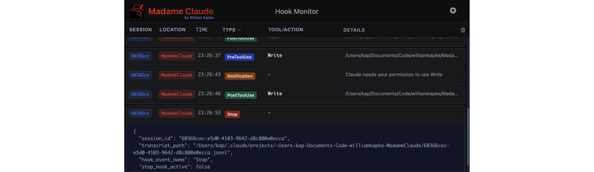

# madame-claude

Real-time monitoring for Claude Code hooks.



## Usage

Start the server:
```bash
npx madame-claude
```

Configure Claude Code hooks in `~/.claude/settings.json`:
```json
{
  "hooks": {
    "PreToolUse": [{
      "matcher": ".*",
      "hooks": [{ "type": "command", "command": "npx madame-claude-bridge" } ]
    }],
    "PostToolUse": [{
      "matcher": ".*",
      "hooks": [{ "type": "command", "command": "npx madame-claude-bridge" } ]
    }],
    "Notification": [{
      "matcher": ".*",
      "hooks": [{ "type": "command", "command": "npx madame-claude-bridge" } ]
    }],
    "Stop": [{
      "matcher": ".*",
      "hooks": [{ "type": "command", "command": "npx madame-claude-bridge" } ]
    }],
    "SubagentStop": [{
      "matcher": ".*",
      "hooks": [{ "type": "command", "command": "npx madame-claude-bridge" } ]
    }]
  }
}
```


Open http://localhost:4519 to view events.

## License

MIT
